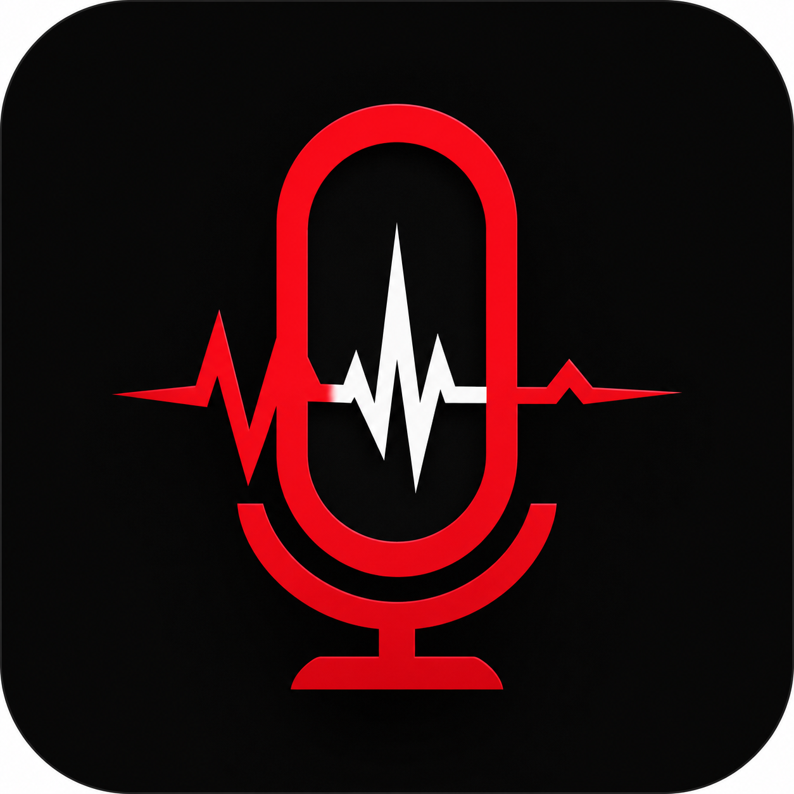
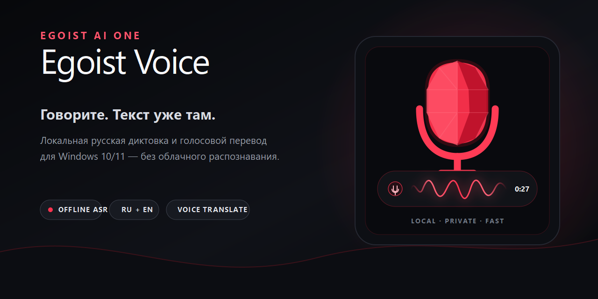
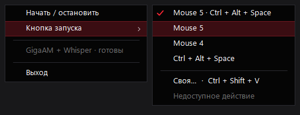

<div align="center">
  
  <h1>Egoist Voice</h1>
  <p><strong>Говорите. Текст уже там.</strong></p>
  <p>Локальная русская диктовка и голосовой перевод для Windows 10/11.</p>

  <p>
    <a href="https://github.com/egoist-ai1/EgoistVoice/releases/tag/v2.2.0-preview.1"></a>
    <a href="https://github.com/egoist-ai1/EgoistVoice/actions/workflows/checks.yml"></a>
    
    
    <a href="LICENSE"></a>
  </p>

  <p>
    <a href="https://github.com/egoist-ai1/EgoistVoice/releases/download/v2.2.0-preview.1/EgoistVoice-Web-Setup-2.2.0.exe"><strong>Скачать Web Installer</strong></a>
    ·
    <a href="#полностью-офлайн-установка">Полностью офлайн</a>
    ·
    <a href="CHANGELOG.md">История изменений</a>
    ·
    <a href="https://boosty.to/eg01stgames"><strong>Поддержать автора</strong></a>
  </p>
</div>



> [!IMPORTANT]
> `2.2.0-preview.1` — публичный unsigned field-test candidate. Исходники и точный payload прошли `480/480` тестов, проверку SHA-256 и download/resume fixture, но полный clean Windows Sandbox/Hyper-V lifecycle ещё не закрыт. Для стабильного канала используйте [2.1.0](https://github.com/egoist-ai1/EgoistVoice/releases/tag/v2.1.0).

## Зачем нужен Egoist Voice

Egoist Voice превращает речь в текст прямо в активном приложении. Удерживаете `Mouse 5`, говорите, отпускаете — локальные модели распознают фразу, нормализуют пунктуацию и безопасно вставляют результат туда, где находится курсор.

- **Никакого облачного ASR.** Аудио и распознанный текст не отправляются во внешние сервисы.
- **Русский без ожидания Whisper.** GigaAM v3 работает основным движком; Whisper Large v3 Turbo подключается только для смешанной RU/EN речи.
- **Технические термины из коробки.** GitHub, Docker, Claude Code, Vue.js, Egoist Voice и другие названия восстанавливаются детерминированно.
- **Голосовой перевод.** Явная команда «переведи» использует локальный общий EGOIST Translation Engine; обычная диктовка остаётся независимой от его состояния.
- **Безопасная вставка.** Voice не вставляет и не копирует текст в поля паролей, а пользовательский clipboard восстанавливается после доставки.
- **Не мешает играм.** Боковая кнопка мыши не перехватывается, когда активно игровое приложение.

## Как это работает

```text
Удержать Mouse 5 → сказать фразу → отпустить
        ↓
WASAPI в памяти → GigaAM → при необходимости Whisper
        ↓
словарь + команды + пунктуация → безопасная вставка
        ↓
«переведи …» → локальный EGOIST Translation Engine → вставка перевода
```

Запись запускается удержанием `Mouse 5`; резервная комбинация — `Ctrl + Alt + Space`. В tray можно выбрать Mouse 4, клавиатуру, совместный режим или собственную глобальную комбинацию.

## Интерфейс

Капсула появляется над панелью задач только на время диктовки. Интерфейс полностью нативный: WPF, PerMonitorV2, Reduce Motion и High Contrast — без web view.

<table>
  <tr>
    <td width="50%"><strong>Слушаю</strong><br />Живая waveform и таймер записи.</td>
    <td width="50%"><strong>Распознаю</strong><br />Единое спокойное состояние для коротких и длинных фраз.</td>
  </tr>
  <tr>
    <td></td>
    <td></td>
  </tr>
  <tr>
    <td><strong>Вставлено</strong><br />Результат доставлен в активное поле.</td>
    <td><strong>Настройка кнопки</strong><br />Mouse 5, Mouse 4, клавиатура или своя комбинация.</td>
  </tr>
  <tr>
    <td></td>
    <td></td>
  </tr>
</table>

## Установка

### Web Installer — рекомендуется

1. Скачайте [`EgoistVoice-Web-Setup-2.2.0.exe`](https://github.com/egoist-ai1/EgoistVoice/releases/download/v2.2.0-preview.1/EgoistVoice-Web-Setup-2.2.0.exe) — около 75 КБ.
2. Запустите файл. Он скачает около 3,19 ГБ из закреплённого GitHub Release.
3. Bootstrapper возобновляет оборванную загрузку, проверяет размер и SHA-256 каждого файла и только затем запускает установку.
4. После успешной установки временный download cache удаляется автоматически. При сбое он сохраняется для продолжения.

Нужны Windows 10/11 x64 и не менее 14 ГБ свободного места для временных файлов и чистой Full Offline установки. .NET и Python отдельно устанавливать не требуется.

### Полностью офлайн установка

Скачайте из одного release и положите в одну папку четыре файла:

```text
EgoistVoice-Web-Setup-2.2.0.exe
EgoistVoice-Setup-2.2.0-inner.exe
EgoistVoice-Setup-2.2.0-inner-1.bin
EgoistVoice-Setup-2.2.0-inner-2.bin
```

Запустите `EgoistVoice-Web-Setup-2.2.0.exe`. Bootstrapper увидит локальный payload, проверит его и не будет обращаться к сети. Для жёсткого offline-режима можно запустить `EgoistVoice-Web-Setup-2.2.0.exe --offline`.

Контрольные суммы находятся в `SHA256SUMS-2.2.0-preview.1.txt` на странице релиза.

> [!WARNING]
> Сборка пока не подписана CA-trusted Authenticode-сертификатом. SmartScreen может показать предупреждение, а Smart App Control — заблокировать запуск. Не отключайте системную защиту ради установки; сверяйте SHA-256 или дождитесь подписанного релиза.

## Что нового в 2.2 Preview

- один Full Offline payload включает GigaAM, условный Whisper, CUDA/Vulkan/CPU runtime и закреплённый EGOIST Translation Engine 1.0.0;
- диктовка работает при отсутствующем или неисправном движке перевода;
- общий движок устанавливается owner-safe и не удаляется, пока его использует другой EGOIST-продукт;
- inline-команды пунктуации не ломают обычные выражения вроде «точка входа» и идентификаторы `Vue.js`, `example.com`, `config.json`;
- варианты произношения названий продуктов приводятся к `Egoist Voice` и `EGOIST Translator`;
- новый web/offline bootstrapper использует только version-pinned GitHub assets и запускает внутренний installer после полной hash-проверки.

Полные технические заметки: [2.2.0-preview.1](docs/releases/2.2.0-preview.1.md) и [CHANGELOG](CHANGELOG.md).

## Приватность и безопасность

- обычная диктовка и перевод выполняются локально после установки;
- приложение не логирует аудио, распознанный или переведённый текст;
- парольные поля и чувствительные цели обрабатываются fail-closed;
- downloader принимает payload только по HTTPS из закреплённого release tag, разрешает редиректы лишь на GitHub asset hosts и проверяет SHA-256 до запуска;
- модели, runtime и сторонние библиотеки сохраняют собственные лицензии — см. [THIRD-PARTY-NOTICES.md](THIRD-PARTY-NOTICES.md).

## Технологии и проверка

.NET 8 · WPF · NAudio/WASAPI · GigaAM v3 · Whisper Large v3 Turbo · HY-MT2 · llama.cpp · Inno Setup

```powershell
dotnet test .\Egoist.Voice.sln -c Release
powershell.exe -NoProfile -ExecutionPolicy Bypass -File .\scripts\Test-EgoistVoiceWebInstaller.ps1
powershell.exe -NoProfile -ExecutionPolicy Bypass -File .\scripts\Build-EgoistVoiceWebInstaller.ps1
```

Кандидат проходит 480 source/release tests, проверку embedded manifest и всех payload SHA-256, PE identity bootstrapper и локальный HTTP fixture с оборванной загрузкой и `Range` resume. Installer execution, upgrade, coexistence и uninstall на чистых Windows остаются отдельным release gate.

## Поддержать автора

Egoist Voice — бесплатный открытый продукт мастерской **Egoist Ai One**. Если приложение экономит вам время, можно поддержать дальнейшую разработку, тестовые стенды и подпись будущих релизов на [Boosty](https://boosty.to/eg01stgames).

## Лицензии

Исходный код — [MIT](LICENSE). Речевые модели, GPU runtime и нативные библиотеки распространяются по собственным лицензиям, перечисленным в [THIRD-PARTY-NOTICES.md](THIRD-PARTY-NOTICES.md).
