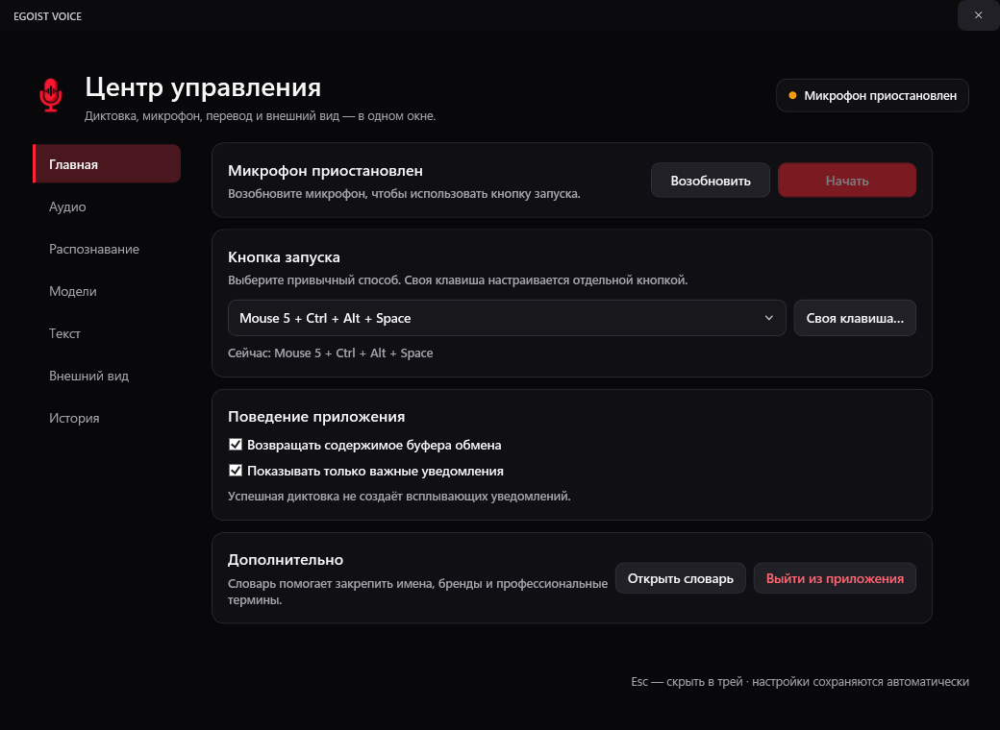
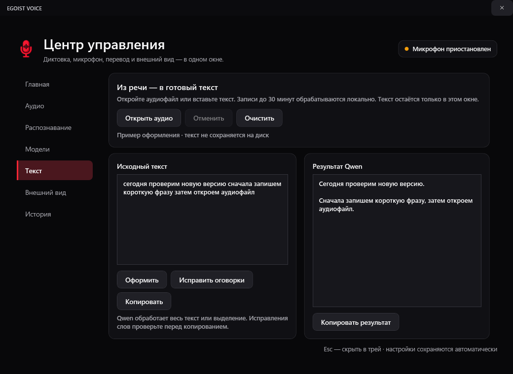
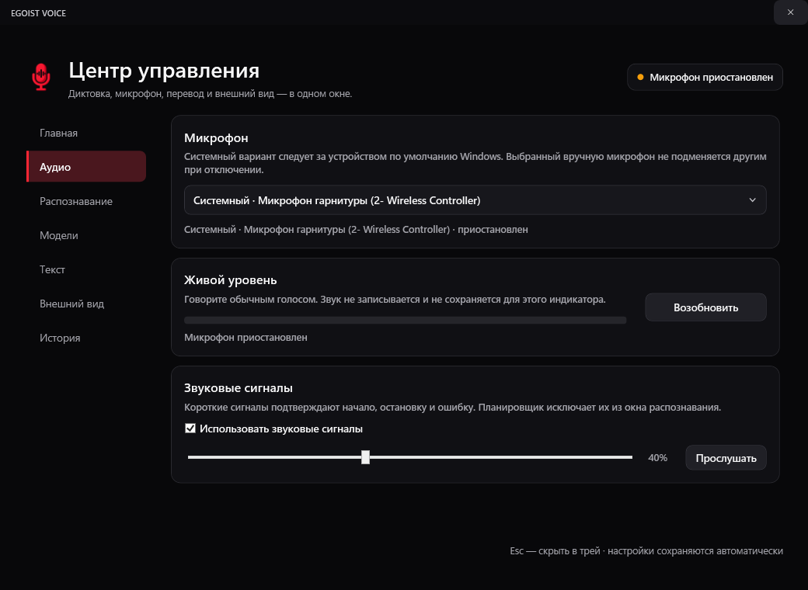
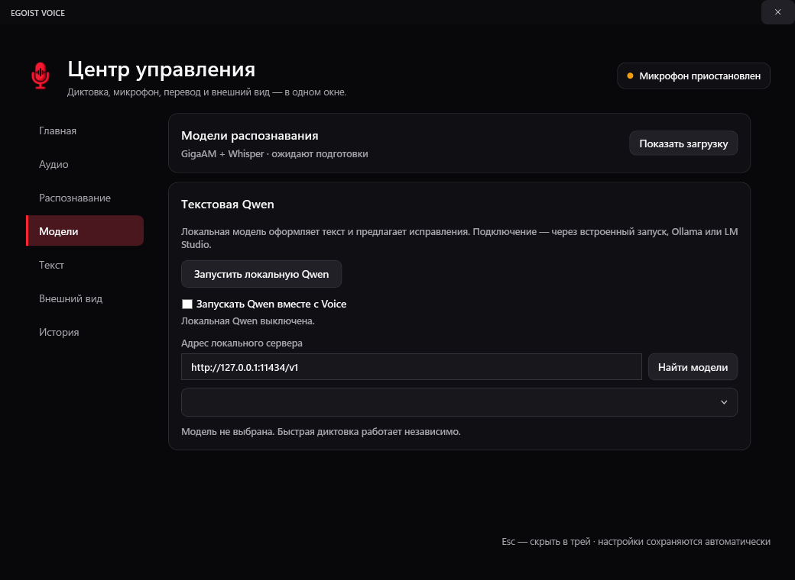
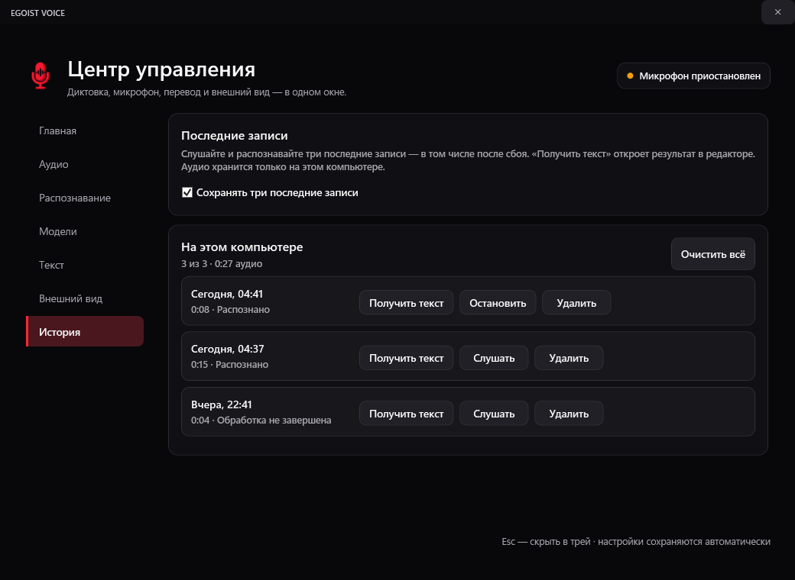
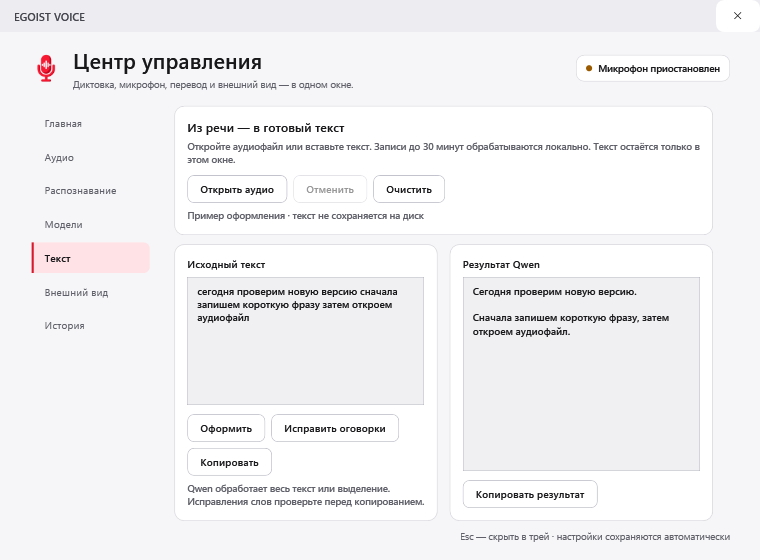

<div align="center">
  
  <h1>Egoist Voice 2.2.0</h1>
  <p><strong>Говорите. Текст появляется там, где нужен.</strong></p>
  <p>Локальная диктовка для Windows — в маленькой капсуле поверх рабочего стола.<br>Русская речь, контекстная коррекция, распознавание англицизмов и аккуратный текст без облаков.</p>
  <p>
    <a href="https://github.com/egoist-ai1/EgoistVoice/releases/tag/v2.2.0"></a>
    
    
    <a href="LICENSE"></a>
  </p>
  <p><a href="#скачать"><strong>↓ Скачать</strong></a> · <a href="docs/USER-GUIDE.md">Руководство</a> · <a href="docs/SCREENSHOTS.md">Скриншоты</a> · <a href="https://boosty.to/eg01stgames">Поддержать</a></p>
</div>

<p align="center"></p>

## Скачать

| | **Compact RU (Рекомендуется)** | **Full + Qwen** |
|---|---|---|
| **Для чего** | Быстрая автономная русская диктовка, минимум веса, мгновенный старт | Русская и смешанная речь, контекстное исправление нейросетью и перевод |
| **Распознавание** | GigaAM INT8 (CPU, без видеокарты) | GigaAM + Whisper large-v3-turbo Q5 (CPU / GPU) |
| **Оформление** | Авто-пунктуация, словарь брендов/терминов, дефисы, исправление опечаток | Всё из Compact + Qwen3-4B Q4_K_M (Vulkan GPU, исправление контекста и оговорок) |
| **Инсталлятор** | Минималистичный фирменный установщик в 1 клик, всё включено (**241 МБ**) | Автономный установщик с полным набором моделей |
| **Комплект** | .NET 8, модели и runtime уже внутри (работает 100% офлайн) | .NET 8, обе ASR-модели, Qwen, переводчик и runtime |
| **Скачать** | **[Скачать инсталлятор (.exe)](https://github.com/egoist-ai1/EgoistVoice/releases/download/v2.2.0/EgoistVoice-Setup-Compact-RU-2.2.0-win-x64.exe)** | **[Установщик Full + Qwen](https://github.com/egoist-ai1/EgoistVoice/releases/download/v2.2.0/EgoistVoice-Full-Setup-2.2.0-win-x64.exe)** |

> [!TIP]
> Установщик **Compact RU** полностью автономен: не требует интернета при установке, не требует отдельной установки .NET или видеокарты. Скачали, нажали «Установить» — и можно сразу нажимать `Mouse 5` или `Ctrl + Alt + Space` для диктовки в любое приложение!

## От голоса до текста

1. Откройте поле ввода в мессенджере, заметке, документе или редакторе.
2. Нажмите **Mouse 5** или **Ctrl + Alt + Space**, произнесите фразу и завершите запись той же кнопкой.
3. Egoist Voice распознает речь локально, применит обработку и вставит результат. Собственную клавишу можно назначить в меню.

Капсула показывает запись, распознавание и результат. Меню открывается через значок в трее: микрофон, модели, оформление и история собраны в одном окне.

<p align="center"></p>

## Возможности

- **Кинематографическая капсула (Obsidian Glass & Dynamic Island).** Аппаратный рендеринг без ограничения кадров (плавность до 240 FPS), пружинная физика появления, стеклянная фаска и рассеянная тень на любом фоне.
- **Частотная реактивность волны (Voice Timbre Dynamics).** Встроенный 3-полосный DSP-фильтр без аллокаций памяти: низкие частоты раздувают тело волны, сибилянты и согласные вызывают микрогребни на вершинах в такт артикуляции.
- **Длительная диктовка до 30 минут.** Запись длинных сообщений, лекций или заметок с автоматической интеллектуальной сегментацией по паузам.
- **Двухуровневая коррекция речи и опечаток:**
  - *Быстрый детерминированный слой (1–5 мс):* нормализация дефисов, союзов, автоматические вопросы и исправление частых оговорок ASR (`в общем`, `вкратце`, `сделать`, `параллельно`, `распознавание`, `грамотно`, `скриншот`).
  - *Контекстный нейро-редактор Qwen3-4B (70–200 мс на GPU):* видит всю структуру предложения и исправляет слова, в которых ASR исказил отдельные буквы из-за невнятной речи или шума, сохраняя авторский сленг (`скуф`, `рофл`, `кринж`, `вайб`).
- **Словарь канонических сущностей.** Точное распознавание брендов, игр и технологий: GitHub, GitLab, Discord, Telegram, Path of Exile 2, Honor of Kings, Astra Terra, Egoist Shield, Egoist Voice, Egoist Account Manager, C#, .NET, Python, RTX 5090 и сотен других.
- **Мгновенная вставка в активное окно.** Возврат прежнего содержимого буфера обмена, собственная горячая клавиша (`Mouse 5` / `Ctrl + Alt + Space`) и пауза микрофона.
- **Локальный переводчик.** Голосовая команда «переведи на английский …» переводит фразу локальным движком.
- **История последних записей.** Прослушивание, повторная расшифровка или удаление последних трёх записей прямо из трея.

<p align="center"></p>

## Как работает контекстная коррекция Qwen

Речь первично распознают **GigaAM и Whisper**. **Текстовая нейросеть Qwen3-4B** (работает локально на Vulkan GPU за 70–200 мс) получает распознанный текст и анализирует контекст предложения:
- **Исправление оговорок и проглоченных букв:** если акустическая модель исказила первую, среднюю или конечную букву слова, Qwen понимает смысл фразы и восстанавливает правильное русское слово в нужном падеже и числе.
- **Спонтанный английский:** разговорные англоязычные обороты посреди русской речи (`Hello, my friend, how are you?`, `by the way`, `check this out`) оформляются с правильной английской орфографией и пунктуацией.
- **Без цензуры и отсебятины:** Qwen запрещено добавлять вводные слова («Привет», «Конечно») или цензурировать разговорный сленг пользователя. Числа, ссылки и пути защищены посимвольными проверками.


## Ваши данные

Аудио и текст обрабатываются на компьютере. После установки обычной диктовке не нужны облачный API, подписка или ключ. EXE-загрузчик Full получает файлы через интернет, если их нет рядом; скачивание моделей из меню тоже требует сети.

Свежие Compact и Full Preview 2 поставляются с выключенным сохранением аудио. При обновлении Full прежняя настройка сохраняется. В portable данные находятся в `Data` рядом с EXE, в Full — в `%LOCALAPPDATA%\EgoistVoice`. Приложение не пишет аудио и распознанный текст в диагностические логи.

## Рассмотрите поближе

| | |
|---|---|
| [](docs/SCREENSHOTS.md#аудио) | [](docs/SCREENSHOTS.md#модели) |
| **Микрофон и уровень звука** | **ASR и локальная Qwen** |
| [](docs/SCREENSHOTS.md#история) | [](docs/SCREENSHOTS.md#темы) |
| **Повторная транскрибация** | **Светлая тема и компактное окно** |

Снимки показывают действующий интерфейс Full на демонстрационных данных. В диагностическом режиме микрофон приостановлен; статусы на снимке не являются отчётом об установленной системе. [Все скриншоты →](docs/SCREENSHOTS.md)

- [Установка, офлайн-комплект и SHA-256](docs/INSTALL.md)
- [Горячие клавиши, словарь, Qwen и решение проблем](docs/USER-GUIDE.md)
- [Изменения и проверка Preview 2](docs/releases/2.2.0-preview.2.md)
- [Сборка из исходников](docs/BUILD.md)
- [Сообщить об ошибке](https://github.com/egoist-ai1/EgoistVoice/issues/new?template=bug_report.yml)

## Для разработчиков

**WPF · .NET 8 · C# · Windows x64.** Закреплённый клиент перевода включён в `vendor/translation-client`; соседний checkout для сборки приложения не нужен. Большие модели поставляются через Releases.

```powershell
dotnet restore Egoist.Voice.sln
dotnet test Egoist.Voice.sln -c Release
dotnet publish Egoist.Voice.csproj -c Release -r win-x64 --self-contained true
```

В опубликованном снимке **748 тестов прошли, пропусков нет**. Это проверка программных контрактов, а не метрика точности речи. Проверки установщиков и ограничения перечислены в release notes.

Исходники — [MIT](LICENSE). Модели и библиотеки — по [отдельным лицензиям](THIRD-PARTY-NOTICES.md). Сделано **EGOIST**.
