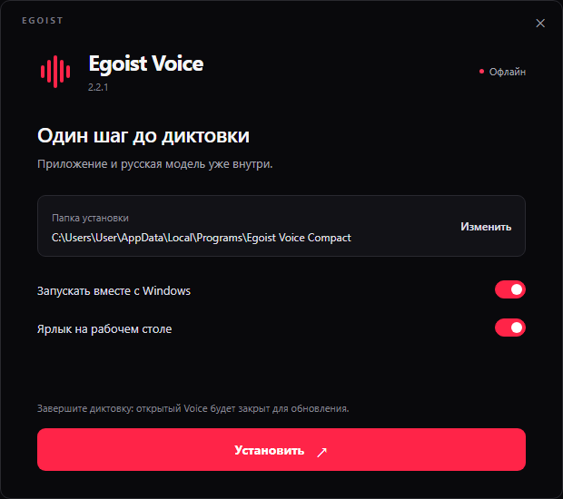

<div align="center">
  
  <h1>Egoist Voice 2.2.1</h1>
  <p><strong>Говорите. Текст появляется там, где нужен.</strong></p>
  <p>Локальная русская диктовка для Windows. Чёрно-алая капсула и режим без перефразирования.</p>
  <p><a href="https://github.com/egoist-ai1/EgoistVoice/releases/tag/v2.2.1">Финальный релиз 2.2.1</a> · Windows 10/11 x64 · <a href="LICENSE">MIT</a></p>
  <p><a href="https://github.com/egoist-ai1/EgoistVoice/releases/download/v2.2.1/EgoistVoice-Setup-Russian-2.2.1-win-x64.exe"><strong>Скачать установщик — около 353 МБ</strong></a></p>
</div>

<p align="center"></p>

## Скачать и начать

1. Скачайте [установщик 2.2.1](https://github.com/egoist-ai1/EgoistVoice/releases/download/v2.2.1/EgoistVoice-Setup-Russian-2.2.1-win-x64.exe).
2. Выберите папку, автозапуск и ярлык, затем нажмите «Установить».
3. Запустите Voice, поставьте курсор в поле ввода и нажмите **Mouse 5** или **Ctrl + Alt + Space**. Произнесите фразу и завершите запись той же клавишей.

В одном EXE находятся приложение, GigaAM INT8 и .NET 8.0.30. Установка и русская
диктовка не требуют сети, облачного ключа или отдельной видеокарты. React/Electron
используется только установщиком; само приложение остаётся WPF/.NET.
Qwen, Whisper и движок перевода в этот комплект не входят.



[Установка и обновление](docs/INSTALL.md) ·
[SHA-256](https://github.com/egoist-ai1/EgoistVoice/releases/download/v2.2.1/SHA256SUMS.txt) ·
[Все файлы релиза](https://github.com/egoist-ai1/EgoistVoice/releases/tag/v2.2.1)

## Что изменилось

- **Капсула и волна.** Плоская капсула шириной 256 пикселей, алый акцент и отклик волны на голос.
- **Дословно по умолчанию.** Автоматическое перефразирование, словарь и перевод по голосовой команде обходятся. Остаются точечные исправления известных названий Egoist Games One, Egoist Shield, Egoist Voice и опечатки «репозиторй».
- **Меньше памяти на запись.** Прежнее преобразование в 16 кГц mono выполняется во время захвата. В проверенных форматах итоговые сэмплы совпадают; хранение звука требует примерно на 83,5% меньше памяти. Это уменьшение аудиобуфера, а не всей памяти приложения.
- **Длинные файлы.** GigaAM читает файл частями; прежний фиксированный предел 30 минут снят. Длительность живой записи по-прежнему ограничена доступной памятью.
- **Новый установщик.** Чёрно-алый интерфейс React с видимыми подписями, выбором папки, прогрессом и состояниями завершения/ошибки.

## Данные и ограничения

Аудио распознаётся на компьютере. При свежей установке история аудио выключена.
Данные этой редакции находятся в `Data` рядом с приложением. Диагностические логи
не содержат аудио и распознанного текста.

Режим «Дословно» сохраняет ответ распознавателя с указанными точечными исправлениями;
он не гарантирует безошибочное распознавание. Незнакомые слова и смешанная речь
могут распознаваться неверно.

Релиз опубликован по решению владельца. Сборка и проверки целостности выполнены;
полный цикл установки, обновления и удаления на чистой Windows пока не проверен.
Установщик не подписан Authenticode. [Проверки и ограничения 2.2.1](docs/releases/2.2.1.md).

Предыдущие Full/Qwen-комплекты доступны в [архиве релизов](https://github.com/egoist-ai1/EgoistVoice/releases).
Они не обновлялись в составе 2.2.1.

## Для разработчиков

**WPF · .NET 8 · C# · Windows x64.** Клиент перевода закреплён в
`vendor/translation-client`; соседний checkout для сборки приложения не нужен.
Большие модели поставляются через Releases.

```powershell
dotnet restore Egoist.Voice.sln
dotnet test Egoist.Voice.sln -c Release
```

[Сборка приложения и установщика](docs/BUILD.md) · [Руководство](docs/USER-GUIDE.md) ·
[История изменений](CHANGELOG.md) ·
[Сообщить об ошибке](https://github.com/egoist-ai1/EgoistVoice/issues/new?template=bug_report.yml)

Исходники — [MIT](LICENSE). Модели и библиотеки — по [отдельным лицензиям](THIRD-PARTY-NOTICES.md).
Сделано **EGOIST**. [Поддержать](https://boosty.to/eg01stgames).
