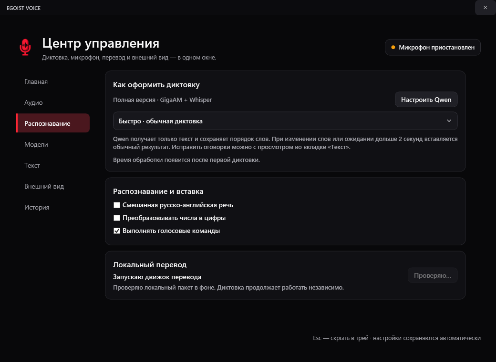
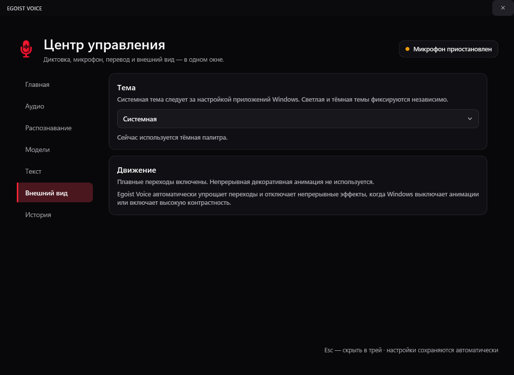
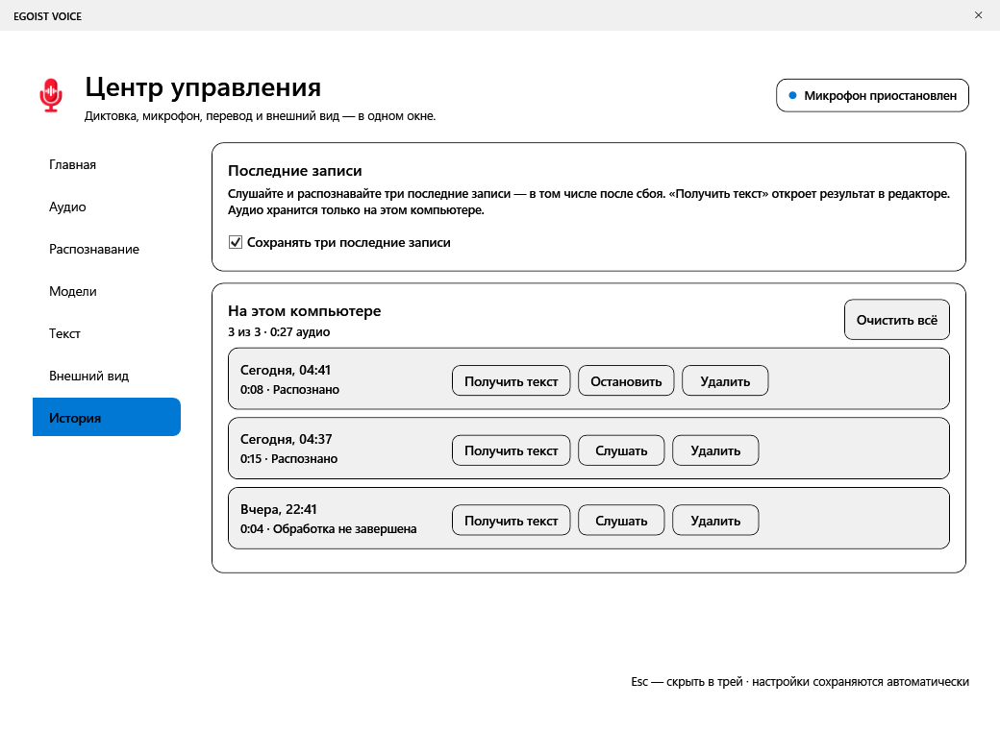

# Интерфейс Preview 2

[← На главную](../README.md) · [Руководство](USER-GUIDE.md)

Снимки получены из WPF текущей сборки. Текст и история демонстрационные,
микрофон в диагностическом режиме приостановлен. Показана Full; Compact
использует то же меню, но содержит только русский GigaAM и CPU.

## Капсула

Небольшое окно остаётся поверх рабочего стола. Волна и цвет состояния показывают этап диктовки.

## Центр управления

Запуск, пауза, горячая клавиша, буфер обмена и словарь. Семь разделов меню без общего скролл-бара.

## Аудио

Выбор микрофона, системное устройство по умолчанию, уровень и громкость сигналов.

## Распознавание

Смешанная речь, словарь, числа и голосовые команды.

## Модели

Состояние речевых моделей, локальная Qwen и доступность движка перевода.

## Текст

Сопоставление исходника и обработанного результата. Исправление оговорок — отдельное действие.

## История

Три последних записи при включённом сохранении: прослушать, распознать повторно или удалить.

## Темы

Системная, тёмная, светлая темы и высокая контрастность. Пример светлого редактора снят при размере 760 × 560.
